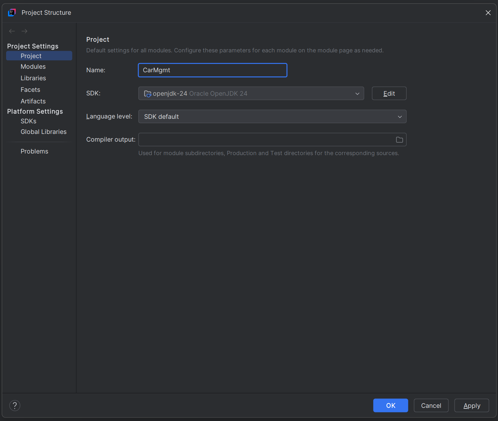
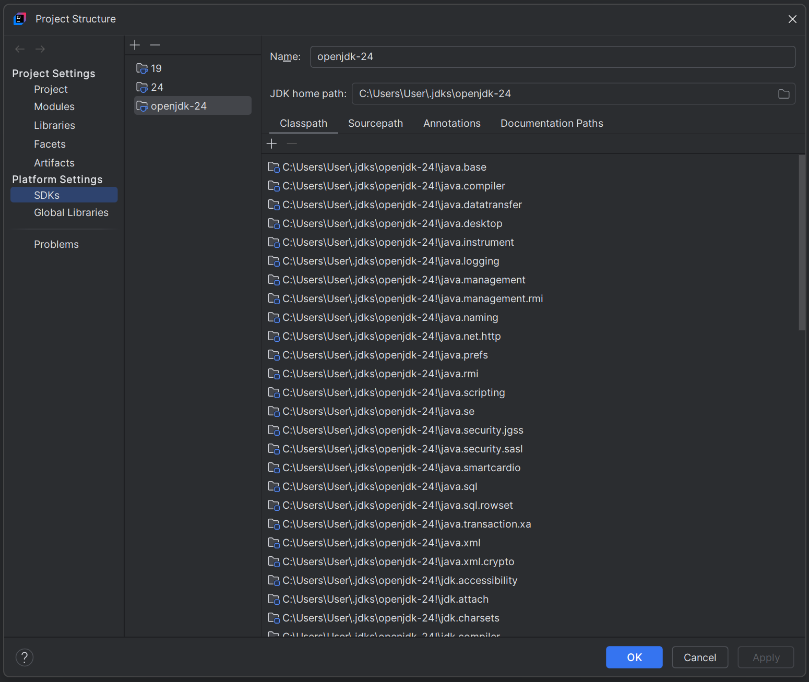
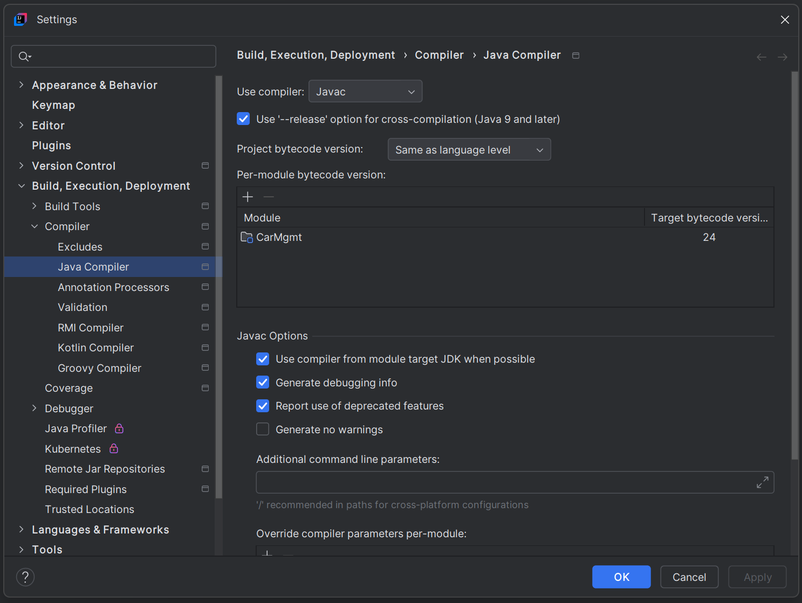
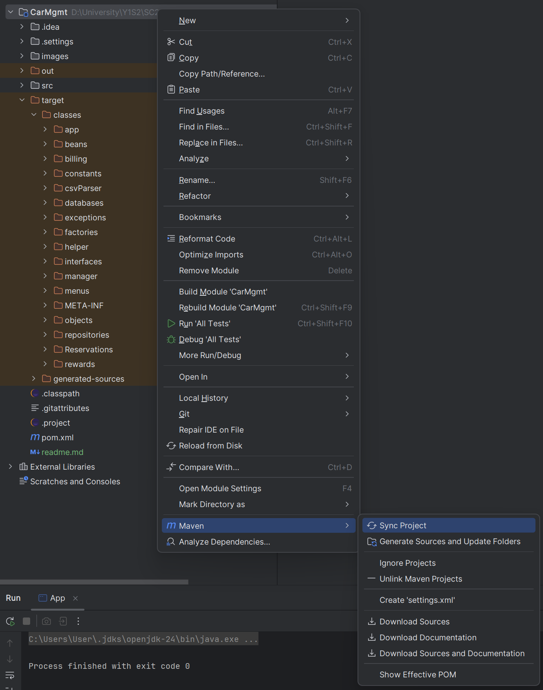
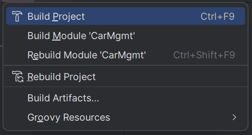
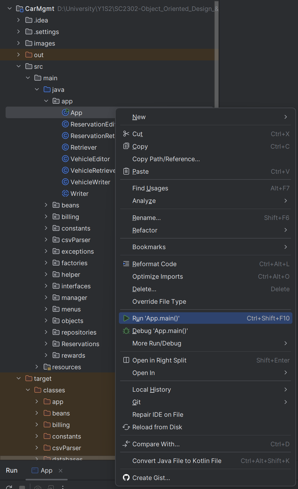
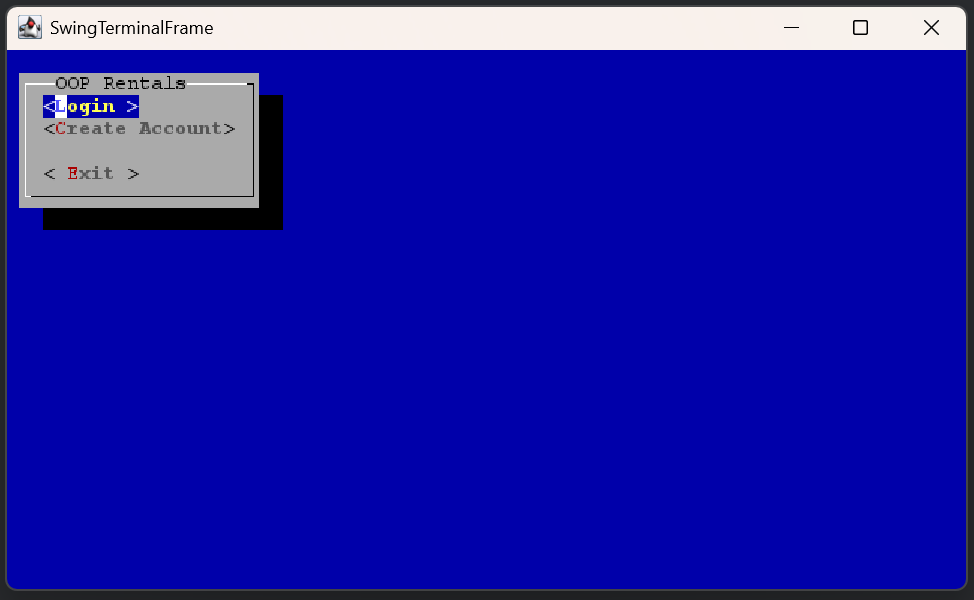

# CAR RENTAL MANAGEMENT SYSTEM

# Setup
This project runs on [Java SDK 24](https://www.oracle.com/sg/java/technologies/downloads/#jdk24-windows).

Please ensure that the following configurations (you may follow exact settings) are setup to successfully run the application:

## File > Project Structure > Project Settings
Ensure the language level is set high enough for the application (safe to set to SDK default).

> 

## File > Project Structure > Platform Settings
Check that your JDK is of the correct version.

> 

## File > Settings > Build, Execution, Deployment > Compiler > Java Compiler
Ensure the "Target bytecode version" is high enough for the application.

> 

## Right Click Project Folder > Maven > Sync Project

> 

## Build > Build Project 
Assuming there are no errors in the build process, you may proceed to run the application (in the next step).

> 

## Run App.java in "src/main/java/app".

> 

The application terminal should launch.
> 